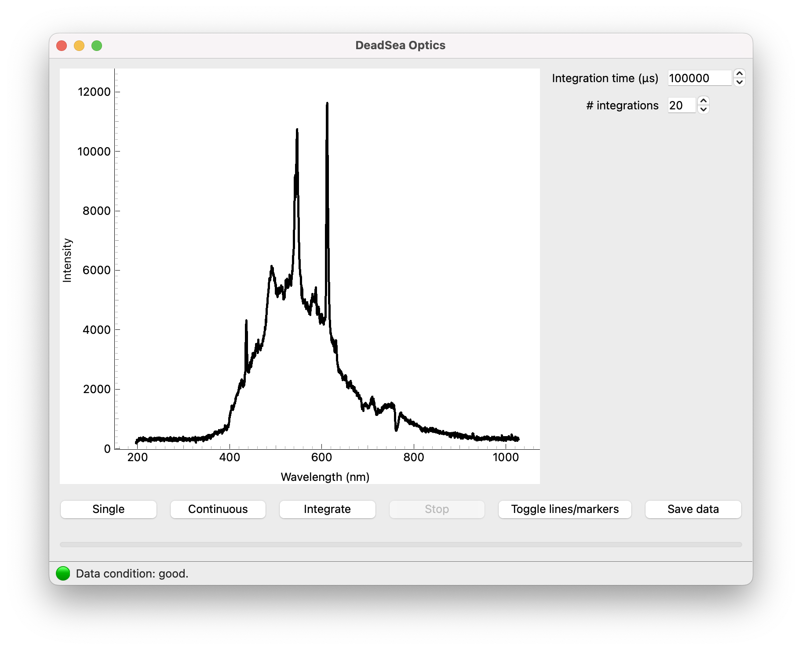

# DeadSea Optics: Spectrosopy software using the legacy Ocean Optics USB2000(+) spectrometer

The Ocean Optics spectroscopy devices are excellent to determine the spectrum of a light source. For older devices, however, the original software does not run on modern operating systems. New software can be expensive, and for many use cases the advanced features of the software are not needed.

Using information from old documents we built applications for working with the Ocean Optics USB2000 and USB2000+ devices. The software consists of a command-line interface, `dso`, and a graphical user interface, _DeadSea Optics_.

## Screenshots



## Installation

The latest version is always available on the [Releases page](<https://github.com/davidfokkema/deadsea-optics/releases/latest>) (link is also in the right sidebar). Please scroll down to *Assets* and download the .msi-installer for Windows and the .dmg-installer for macOS. The application will also run on Linux, but no installer packages are provided at this moment. For Linux, follow the instructions below to install the command-line interface and optionally start the GUI using the provided `gui` command.

## Driver installation on Windows

DeadSea Optics needs a driver to access the Ocean Optics USB device on Windows. The generic WinUSB device is sufficient, but it is unfortunately necessary to manually select that driver using administrator privileges.

1. Connect the Device: Plug your USB device into your computer.
2. Open Device Manager: Press Win + X and select Device Manager.
4. Locate your Ocean Optics USB device. It might be listed under "Other devices" with a yellow warning icon.
5. Right-click on the device and select Update driver.
6. Choose Browse my computer for driver software.
7. Select Let me pick from a list of available drivers on my computer.
8. Scroll down and select Universal Serial Bus devices.
9. From the list, choose WinUSB Device in both the left column (Manufacturer) and right column (Model) and click Next.

Your device should now be available to applications like DeadSea Optics.

## Command-line interface

If you want to use the command-line interface, you can install using pip, pipx or, recommended, [uv](https://docs.astral.sh/uv/getting-started/installation/):
```
pipx install deadsea-optics
```
```
uv tool install deadsea-optics
```
This provides the identical `deadsea-optics` and `dso` commands.

You can also run the application directly using `uvx` or `uv tool run`:
```
uvx deadsea-optics
```
and even start the GUI directly, without installing, using
```
uvx deadsea-optics gui
```

## Usage

The GUI interface is pretty self-explanatory. You can perform a `Single` measurement, a `Continuous` measurement, or `Integrate` over multiple measurements to increase the signal-to-noise ratio. The `integration time` is the time the sensor is actively recording a spectrum for a single measurement. A longer integration time effectively reduces the noise, but can result in overexposure of the sensor. This will be indicated in the status bar at the bottom of the screen. If you can't increase the integration time because of overexposure, you can integrate over `# integrations` number of measurements which will further increase the signal-to-noise ratio. Finally, the data can be plotted as a line or scatter plot and the data can be saved to a CSV file.

From the command line, the GUI application can be started with
```
dso gui
```
The command-line interface is perfect to do a quick measurement and write the data to a CSV file, or to perform multiple measurements with the exact same parameters. To check that a compatible device is available, run
```
dso check
```
For a single standard measurement, run
```
dso spectrum
```
Quite a few options are available. For an overview, run
```
dso spectrum --help
```
For example, to perform a measurement with an integration time of 0.5 seconds and write the data to a file without showing a graph or table, type
```
dso spectrum -t 500_000 -q -o data.csv
```
where the underscores in the number are entirely optional. To integrate over multiple spectra, run
```
dso integrate
```
which has many of the same options, and one extra to provide the number of measurements.

## Helpdesk

We don't have a formal helpdesk, but please drop a line to d.b.r.a.fokkema@vu.nl if you need assistance or have questions.

